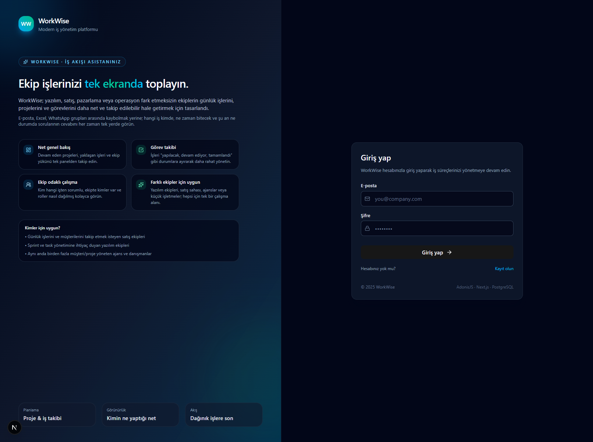

<div align="center">

# 🧭 WorkWise · İş Akışı Asistanınız



**Ekip işlerinizi tek ekranda toplayın.**
WorkWise; yazılım, satış, pazarlama veya operasyon fark etmeksizin ekiplerin günlük işlerini, projelerini ve görevlerini daha net ve takip edilebilir hale getirmek için tasarlandı.

E-posta, Excel dosyaları ve WhatsApp grupları arasında kaybolmak yerine;
**“Hangi iş kimde?”, “Ne zaman bitecek?” ve “Şu an ne durumda?”** sorularının cevabını her zaman tek yerde görün.

</div>

---

## 🌟 Neler Sunar?

### 🔍 Net genel bakış

* Devam eden projeleri, yaklaşan işleri ve ekip yükünü tek panelden takip edin.
* Özet kartlarla proje ve görev durumunu hızlıca görün.

### 🗂️ Görev takibi

* İşleri “yapılacak · devam ediyor · tamamlandı” durumlarına ayırın.
* Öncelik seviyeleriyle (düşük / orta / yüksek) hangi işin öne alınması gerektiğini netleştirin.

### 👥 Ekip odaklı çalışma

* Kim hangi işten sorumlu, ekipte kimler var, roller nasıl dağılmış kolayca görün.
* Proje bazlı ekip üyeleri ve roller (üye / lider) ile kontrollü erişim.

### 🧩 Farklı ekipler için uygun

* Yazılım ekipleri (sprint / task yönetimi)
* Satış sahası ekipleri (günlük iş & müşteri takibi)
* Ajanslar ve danışmanlar (birden fazla müşteri/proje)
* Küçük işletmeler (operasyon ve günlük iş akışı)

### 🎯 Kimler için ideal?

* Günlük işlerini, müşterilerini ve sorumluluklarını kaybetmek istemeyen satış ekipleri
* Sprint ve task yönetimine ihtiyaç duyan yazılım ekipleri
* Aynı anda birçok müşteri/proje yöneten ajanslar ve danışmanlar
* Ekip içi iş akışını daha görünür yapmak isteyen işletmeler

---

## 🛠️ Teknoloji Yığını

<div align="center">

| Teknoloji                                                                                 | Açıklama                                |
| ----------------------------------------------------------------------------------------- | --------------------------------------- |
|  **Next.js**        | Modern, hızlı frontend arayüzü          |
|  **React**              | Bileşen tabanlı UI yapısı               |
|  **Tailwind CSS** | Esnek ve hızlı stil altyapısı           |
|  **TypeScript**    | Tip güvenliği ve daha sağlam kod tabanı |
|  **AdonisJS**        | Backend API ve iş mantığı               |
|  **PostgreSQL**    | Güçlü, güvenilir veritabanı             |
|  **Docker**            | Kolay kurulum ve izole çalışma ortamı   |

</div>

Ek olarak:

* 🧠 **Zustand** ile hafif global state yönetimi (auth & kullanıcı bilgileri)
* 🎛️ **Lucid ORM** ile temiz veritabanı erişimi

---

## 📂 Klasör Yapısı

```bash
workwise/
├── backend/          # AdonisJS API
├── frontend/         # Next.js arayüz
├── screenshots/      # README görselleri (ör: login.png)
├── docker-compose.yml
├── Dockerfile
└── README.md
```

---

## ⚙️ Kurulum

Aşağıdaki adımlar yerel geliştirme ortamı içindir.

### 1️⃣ Depoyu klonlayın

```bash
git clone https://github.com/kullanici/workwise.git
cd workwise
```

---

## 2️⃣ Backend Kurulumu (AdonisJS)

### 2.1 Ortam değişkenleri (backend/.env)

Aşağıdaki örnek AdonisJS backend için kullanılan gerçek değişken isimlerine göredir:

```env
TZ=UTC
PORT=3333
HOST=localhost
LOG_LEVEL=info
APP_KEY=YOUR_APP_KEY
NODE_ENV=development

DB_HOST=127.0.0.1
DB_PORT=5432
DB_USER=workwise
DB_PASSWORD=workwise123
DB_DATABASE=workwise_db
```

> `APP_KEY` değerini kendi ortamınızda `node ace generate:key` ile üretmeniz önerilir.

### 2.2 Bağımlılıkların kurulması

```bash
cd backend
npm install
```

### 2.3 Migrasyonların çalıştırılması

```bash
node ace migration:run
```

### 2.4 Backend'i başlatma

```bash
node ace serve --watch
```

Ardından API şu adreste çalışıyor olacaktır:

```text
http://localhost:3333
```

---

## 3️⃣ Frontend Kurulumu (Next.js)

### 3.1 Ortam değişkenleri (frontend/.env.local)

```env
NEXT_PUBLIC_API_BASE_URL=http://localhost:3333/api/v1
```

### 3.2 Bağımlılıkların kurulması

```bash
cd frontend
npm install
```

### 3.3 Frontend'i başlatma

```bash
npm run dev
```

Uygulama varsayılan olarak şu adreste çalışır:

```text
http://localhost:3000
```

---

## 🐳 Docker ile Çalıştırma

Proje kök dizininde tek komutla hem frontend hem backend'i ayağa kaldırabilirsiniz:

```bash
docker compose up --build
```

Ardından:

* **Frontend:** [http://localhost:3000](http://localhost:3000)
* **Backend:** [http://localhost:3333](http://localhost:3333)

Docker ortamında veritabanı bağlantı bilgileri `docker-compose.yml` içinden gelir ve backend'in `.env` dosyası ile uyumlu olacak şekilde yapılandırılmalıdır.

---

## 🧭 Yol Haritası

> Geliştirme aktif olarak devam ediyor. Aşağıdaki maddeler zamanla güncellenecektir.

* [x] Kullanıcı kayıt & giriş (login/register)
* [x] Proje oluşturma, listeleme ve detay sayfası
* [x] Görev oluşturma, durum & öncelik yönetimi
* [x] Proje bazlı ekip üyeleri ve roller
* [x] Proje detay sayfasında mini görev panosu (kanban vari görünüm)
* [ ] Görev atama (assignee) arayüzü ve detaylı görev kartı
* [ ] Organizasyon yapısı (ekipler, departmanlar, çoklu proje alanları)
* [ ] Gelişmiş filtreleme, arama ve sıralama
* [ ] Bildirim sistemi (e-posta / uygulama içi)
* [ ] Çoklu dil desteği (TR / EN)
* [ ] Üretim ortamına dağıtım (CI/CD dokümantasyonu)

---

## 👨‍💻 Katkı ve Kullanım

* Proje şu an geliştirme sürecindedir.
* Issue açarak, öneri yazarak veya PR göndererek katkıda bulunabilirsiniz.
* Kendi ekibinize uyarlamak için fork'layıp ihtiyaçlarınıza göre yeniden şekillendirebilirsiniz.

---
